# IoT Security Project (pre)Report <!-- omit in toc -->

- [Intro](#intro)
- [Project Scope](#project-scope)
- [Architecture](#architecture)
- [Southbound](#southbound)
  - [Arduino UNO](#arduino-uno)
    - [**Sensors** and **ADC**](#sensors-and-adc)
    - [UART](#uart)
  - [ESP8266](#esp8266)
- [Cloud](#cloud)
    - [SSH Key](#ssh-key)
    - [Ubuntu UFW](#ubuntu-ufw)
  - [MQTT Broker - Mosquitto](#mqtt-broker---mosquitto)
    - [Let's Encrypt certificate](#lets-encrypt-certificate)
    - [Mosquitto configuration](#mosquitto-configuration)
  - [Database](#database)
  - [Node-RED](#node-red)
  - [Data flow](#data-flow)
  - [Node-RED - *Encrypt and Store*](#node-red---encrypt-and-store)
  - [Node-RED - *Query and Decrypt*](#node-red---query-and-decrypt)
- [Northbound](#northbound)
  - [Android App](#android-app)
    - [MqttHandler.dart](#mqtthandlerdart)
    - [Front End](#front-end)
  - [NodeRED Dashboard](#nodered-dashboard)
    - [Back-end](#back-end)
    - [Front-end](#front-end-1)
- [Conclusion](#conclusion)

## Intro

The IoT Security Project Report provides an overview and analysis of the security aspects implemented in an IoT project. As the Internet of Things (IoT) continues to expand, ensuring the security and privacy of connected devices and their data becomes increasingly important.

This report delves into the various components of the IoT system, categorized into three main sections: Northbound, Cloud, Southbound, Transport Protocol. Each section represents a distinct aspect of the project and plays a crucial role in the overall security architecture. In addition to the man categories there are other that are no less important like Transport Layer - MQTT, Database. Both are included in the cloud section, but it is important to mention them thanks to their role in the project.

The Southbound category represents the source of the data, which is the physical device in this case. This section explores the specifications, hardware components, and security features implemented in the physical device to ensure protection against physical tampering or unauthorized access.

The Cloud section focuses on the cloud infrastructure. Inside the cloud infrastructure are located also the the MQTT broker, used to facilitate communication between the devices and the cloud, and the database, used to store data. The protocols, security measures, and authentication mechanisms employed to establish a secure and reliable connection are discussed.

The Northbound category encompasses the applications that read and interact with the data collected by the IoT system, such as the Android App and NodeRED dashboard. The security measures implemented in these applications for secure user authentication, data visualization, and control over connected devices are analyzed.

Throughout this report, best practices, challenges faced, and lessons learned in securing an IoT system are highlighted within these three macro categories. By examining the security measures within each category, valuable insights and recommendations for enhancing the overall security posture of IoT projects are provided.

The IoT Security Project Report delves into the details of the Northbound applications, the Cloud, Southbound physical device, uncovering the security measures implemented to protect against potential threats.

## Project Scope

The project has been designed to address the safety needs of a chemical laboratory where chemical gas releases and fires may occur. Its main purpose is to ensure a safe working environment for the laboratory personnel, prevent potential incidents, and minimize the negative effects resulting from such situations.

The key features of the project include timely detection of chemical gas releases and fires, immediate alerting of the personnel, and implementation of mitigation measures to minimize the harmful effects. The specific objectives of the project are outlined below:

1. Detection of chemical gas releases: The implemented system allows for the real-time identification and monitoring of any leaks or releases of chemical gases within the laboratory. Using specially designed sensors, the system can detect the presence of hazardous substances in the air and generate an immediate alert to the laboratory personnel.

2. Fire detection: The project also encompasses early fire detection. Smoke, heat, and flame sensors are strategically placed in the laboratory to promptly detect signals of potential fires. These sensors trigger an alarm and send an immediate notification to the personnel so they can take necessary evacuation and extinguishing actions.

3. Alerting and notifications: When a chemical gas release or fire is detected, the system activates an audible and visual alarm within the laboratory to immediately alert the personnel present. Simultaneously, automatic notifications are sent to the safety officers and designated personnel through mobile devices or an internal communication system.

4. Mitigation measures: In addition to timely alerts, the project includes the implementation of mitigation measures to minimize the negative effects of chemical gas releases and fires. These measures may involve activating ventilation systems, automatically closing gas valves, isolating specific areas, and deploying specialized teams to handle the emergency.

By implementing this project, the chemical laboratory will significantly enhance the safety of its operations. The timely detection of chemical gas releases and fires, coupled with appropriate alerting and mitigation measures, will help protect the personnel, prevent material damages, and preserve the surrounding environment.

The project aims to provide the laboratory with a solid safety foundation, enabling the personnel to carry out their activities in a controlled and protected environment, in accordance with the best industrial safety practices.

## Architecture

The architecture comprises three essential components, as mentioned befor: the **Southbound**, **Cloud**, and **Northbound**.

The Southbound component encompasses the physical device responsible for sensing environmental data, such as temperature and air quality, as well as managing alarms triggered by threshold exceedances. It also includes actuating mechanisms, including a buzzer for alerting users to potential dangers and a fan for enhancing air circulation.

The Cloud component focuses on the cloud infrastructure, incorporating an MQTT broker (Mosquitto) for reliable device communication, a database (MySQL) for secure data storage, and Node-RED for efficient data flow management.

Lastly, the Northbound component consists of user-facing applications, namely the Android App and Node-RED Dashboard, providing intuitive interfaces for data visualization and interaction. By integrating these three components, the architecture ensures a secure, efficient, and user-friendly IoT system capable of safeguarding data privacy, detecting anomalies, and facilitating informed decision-making.

<p align="center">
  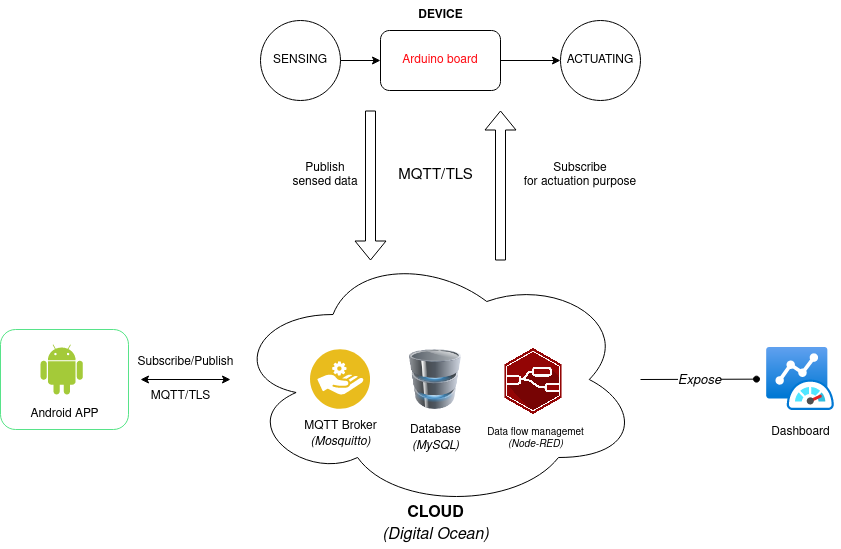
</p>

The overall system architecture is illustrated in the  image. This image provides a visual representation of how the different components interact and highlights the protocol used within the system.

## Southbound

This section provides an overview of the part of the project where data are generated.
The generation of the data that flow in the architecture are sensed from the external and are in the form of Temperature (°) and Quality of Air.
The data are sensed using the physical device discussed below.
The devices used for the project are two:

- Arduino UNO: used for sesnsing the data;
- ESP8266: used for network interfacing.

<p align="center">
  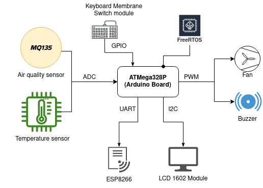
</p>

### Arduino UNO

The **Arduino Uno** acts as a pivotal board housing the ATMega328P microprocessor, providing the necessary computational power for the project. Within the Arduino Uno, several components are employed to facilitate the system's functionality.

#### **Sensors** and **ADC**

For the sensing phase, two distinct analogic sensors are utilized: the MQ135 and the TMP36.

<p align="center">
  
  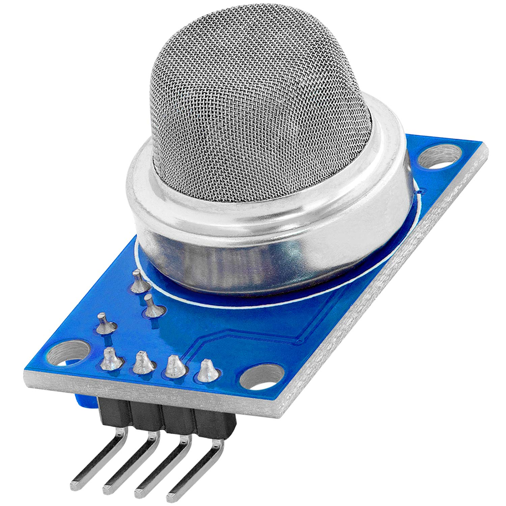
</p>

The MQ135 sensor is employed to monitor the quality of the surrounding air, enabling the system to detect any potential air pollution or harmful gases. On the other hand, the TMP36 sensor is responsible for measuring the ambient temperature, providing valuable data for temperature monitoring purposes. These sensors are directly connected to the Arduino Uno, leveraging its analog-to-digital converter (ADC) capabilities to convert the analog sensor readings into digital values that can be processed by the microprocessor.

By leveraging the Arduino Uno's versatile capabilities and integrating the MQ135 and TMP36 sensors, the system can accurately sense and monitor both the air quality and temperature. This information serves as crucial input for subsequent stages of the project, such as generating alerts in case of threshold exceedance or initiating the actuating phase for appropriate actions. The Arduino Uno acts as a reliable and robust foundation, enabling seamless integration between the physical sensing components and the overall IoT system architecture.

The chosen approach involves manipulating the internal registers of the ATmega328P microprocessor to ensure a robust, secure, optimized, and direct code implementation. This method provides precise control over the microprocessor's functionalities, allowing for customization according to the project's specific requirements.

``` C
void adc_setup_temp(void){
  DDRC&=~(1<<0); //DDRC pin 0 as input for ADC
  ADCSRA = 0x87; //make ADC enagle and select ck/128
  ADMUX = 0b11000000; //Vref Internal

}
```

``` C
void adc_setup_air(void){
  DDRC&=~(1<<1); //DDRC pin 1 as input for ADC
  ADCSRA = 0x87; //make ADC enagle and select ck/128
  ADMUX = 0b01000001; //Vref AVCC pin

}
```

In this code snippet, has been used direct the register manipulation to configure the ADC registers for analog-to-digital conversion. By setting the appropriate bits in the ADMUX and ADCSRA registers, they select the ADC input and enable it with a specific prescaler value.

After the configuration, an ADC conversion is initiated by setting the ADSC bit, and the code waits for the conversion to complete. Once the conversion is finished, the raw ADC value is retrieved converted into voltage using the known voltage reference.

This approach of manipulating the microprocessor's internal registers provides precise control over its functionalities, resulting in an optimized and tailored code implementation for the project.

#### UART

In order to enable message transmission from the sensors to the cloud, the project utilizes the MQTT protocol. However, a crucial requirement for this implementation is establishing an internet connection. This is achieved by utilizing an ESP8266 module, which comes equipped with built-in Wi-Fi connectivity, to connect to an accessible hotspot. To facilitate data transfer from the Arduino to the ESP8266, the project leverages the UART (Universal Asynchronous Receiver-Transmitter) serial communication. By connecting the RX (receive) and TX (transmit) pins of both the Arduino and the ESP8266, a seamless data flow between the two devices is established.

First of all the UART is initialized:

``` C
void UART_init()
{
    // Setup Trasmission rate
    UBRR0H = (BAUD_PRESCALER >> 8);
    UBRR0L = BAUD_PRESCALER;

    // Enable both in and out trasmission
    UCSR0B = (1 << RXEN0) | (1 << TXEN0);

    // Setup data format: 8 data bit, 1 stop
    UCSR0C = (1 << UCSZ01) | (1 << UCSZ00);
}

```

Then 2 different function permits the data trasmission:

``` C

void UART_sendString(const char* data)
{
    // Send each character until the null terminator
    while (*data != '\0')
    {
        UART_sendChar(*data);
        data++;
    }
}

```

``` C
void UART_sendChar(char data)
{
    // Wait until the trasmission buffer is empty
    while (!(UCSR0A & (1 << UDRE0)));

    // Upload the data in the trasmission buffer
    UDR0 = data;
}

```

```UART_sendChar``` wait until the trasmission buffer is empty and then upload the data in the USART Data Register 0. When the data are written on the UDR, it will be trasnferred by the UART peripheral through the serial transimt pin.

### ESP8266

The ESP8266 receives from the UART the data from the Arduino UNO and sends it using the Trasport Layer Security (TLS). The connection to the cloud is established using the MQTT (Message Queuing Telemetry Transport) protocol enriched with the TLS (Transport Layer Security) security protocol. This combination ensures a secure and protected connection between the ESP8266 device and the cloud. By using the generated certificates and stored in the device flash memory, the ESP8266 device can establish a secure connection with the cloud. These certificates allow for the verification of the device and server identities in the TLS handshake process, thereby preventing potential man-in-the-middle attacks.

## Cloud

The cloud section focuses on the cloud infrastructure and services employed in the IoT Security project. It includes various components critical to the IoT Security project, including the MQTT broker, database, and the utilization of Node-RED for data flow management.

The cloud is managed using a Digital Ocean droplet that serves as the central point of the project.

#### SSH Key

The communication for the configuration of the server is accomplished by using SSH key. Another form of security thanks to disabling of the password login of the SSH.

#### Ubuntu UFW

In the ubuntu droplet is also used the *Uncomplicated Firewall* aka UFW. To ensure that unwanted connection are unallowed.

### MQTT Broker - Mosquitto

The MQTT broker plays a pivotal role in facilitating communication between the IoT devices and the cloud services. It acts as a central hub, receiving messages from the devices and distributing them to the relevant cloud services. The MQTT broker's implementation includes robust security measures to ensure the confidentiality, integrity, and availability of the transmitted data. This involves the use of secure authentication protocols, access controls, and encryption techniques to protect against unauthorized access and data breaches.

The chosen MQTT broker for the project is Mosquitto. The communication between the different subscribers is secured using TLS (Transport Layer Security). Additionally, username and password authentication is implemented to ensure authorized access to the MQTT broker.

To manage the TLS protocol, Certbot is utilized, and the project obtains certificates through "Let's Encrypt". The obtained certificates are associated with the domain "iotprojectunical.me", which is acquired from the namecheap website.

By leveraging TLS, username and password authentication, and obtaining certificates from Let's Encrypt, the project establishes a secure and encrypted communication channel between the MQTT broker and the subscribers. This setup ensures the confidentiality, integrity, and authenticity of the transmitted data within the IoT Security project.

Three foundamental user are created for authentication of Mosquitto Broker:

- *mqttesp*: used by the esp to enstablish an MQTT connection with the broker;
- *mqttnodered*: used by the Node-RED flow;
- *mqttandroid*: used by the Android App;

#### Let's Encrypt certificate

To acquire the SSL certificates to enable the TLS MQTT connection is used a nonprofit Cerficate Authority called *Let's Encrypt*.
For accomplish the certificate is used a tool called *Certbot*.

The SSL cerficate need a real existing domain and the one used in this project is acquired from the *Namecheap* web hosting agency.

#### Mosquitto configuration

To enable the Mosquitto TLS communication it is needed to create new configuration file in the mosquitto *conf.d*.

The file contain the following information:

``` Bash
allow_anonymous false
password_file /etc/mosquitto/passwd
listener 1883 localhost
listener 8883
certfile /etc/letsencrypt/live/iotprojectunical.me/cert.pem
cafile /etc/letsencrypt/live/iotprojectunical.me/chain.pem
keyfile /etc/letsencrypt/live/iotprojectunical.me/privkey.pem
```

First of all disallow the anonymous publish and subscribe.
Then enable the password file where the password are saved in a sha256 encryption.
Setup then the cerficate obtained by the Certbot on the namecheap domain: *iotprojectunical.me*

### Database

In the database section, we discuss the database management system utilized in the IoT Security project.

The database utilized in the project is MySQL. However, for the encryption of the database, a deliberate decision was made not to employ Transparent Data Encryption (TDE). Instead, a manual approach to data encryption was deemed more suitable for educational purposes. Consequently, the data is manually encrypted using the DES (Data Encryption Standard) algorithm before being inserted into the database.

By employing manual encryption, the project gains greater control over the encryption process and can apply specific encryption techniques tailored to its requirements. This approach allows for the secure storage of sensitive data within the database.

When retrieving the data from the database, it can be decrypted, enabling various functions and operations to be performed on the decrypted data. This provides the necessary flexibility for data analysis, manipulation, and processing while maintaining the security of the sensitive information.

The decision to opt for manual data encryption with DES rather then of TDE demonstrates a purposeful choice made within the project for educational purposes. It offers insights into the manual encryption process and provides an opportunity to gain a deeper understanding of data encryption techniques and their implementation within a secure environment.

The table where the data are stored are created by using the following code:

``` SQL
CREATE TABLE readings (
  device varchar(4) NOT NULL,
  datetime TIMESTAMP NOT NULL,
  sensor varchar (20) NOT NULL,
  value varchar(44) NOT NULL,
  PRIMARY KEY (device, datetime, sensor)
) ENGINE = InnoDB

```

So a *redings* table is created to store both temperature and air quality readings.
It has a different column describing the various information of the stored data:

- **device** value to show from wich device the reading comes; in this project is used just one device;
- **Timestamp** value;
- **sensor** value that store if it is a Temperature or Air Quality reading;
- **value** part that store the encrypted form of the Float calculated by the Arduino sensors.

The Primary Key is setup by a triple of device, datetime and sensor.

### Node-RED

Regarding Node-RED, it is also hosted in the cloud. It is protected by username and password authentication, and access to it is secured using the HTTPS protocol through the implementation of the Nginx web server.

Node-RED plays a crucial role in managing the flow of data within the project. Data is received by Node-RED through MQTT, ensuring secure communication with TLS encryption. From there, the data is directed towards two main destinations. Firstly, it flows towards the dashboard, which provides a visual representation of the data for monitoring and analysis. Secondly, the data is routed towards the encryption phase, where it is encrypted before being securely stored in the database.

By employing username and password authentication and implementing HTTPS through Nginx, Node-RED ensures secure access and communication. The integration with MQTT, along with TLS encryption, guarantees the confidentiality and integrity of the data as it traverses through the system. The combined functionalities of Node-RED, MQTT with TLS, and the secure storage of data in the database contribute to the overall security of the IoT Security project.

The Node-RED app is protected by an authentication system.

<p align="center">
  
</p>

First of all is inject in the system the AES key created in the Cloud using the *OpenSSL Tool*.

<p align="center">
  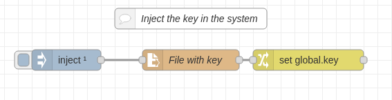
</p>

Then the Node-RED MQTT node subscribe to all the topic of the Mosquitto Broker, using the wildcard "#".
Data that flow to the Mosquitto broker flow into 2 different subflow, one for the Dashboard and the other one for the ***Encription and Store*** phase.

The third phase of the Node-RED flow start from the user input on the Dashboard and follow 2 flow. One to setup some command on the Arduino Board and one for the ***Query and Decript*** phase.

### Data flow

Before goin in the deep for the Node-RED different phase let's talk about the system **Data Flow**.
The data flow from Arduino to the Database are in JSON format.
This is an example of *readings*.

``` JSON
{"sensor":"temperature","value": 26.33}"
```

The JSON is composed by a map of keyvalue of size 2. The first key/value indicates the sensor used for the reading (e.g. Temperature, Air);
the second key/value couple indicates the value of the reading.

Those data has to flow in Node-RED, has to be encrypted and then stored in the MySQL database.

> The encription could have been done in two different way in this system: **TDE Method** and **Manual method**.
The TDE method (Transparent data encryption) executes encryption and decryption within the database engine itself. This method doesn’t require code modification of the database or application and is easier for admins to manage. However is not the best eligible in a didactic enviroment. The manual method is the best fit for understanding how encryption works and to study also the AES encryption method.

For this project, it is chosen to encrypt only the value part of the JSON data. The encryption is made by using the AES algorithm given by a Node-RED node.

> #### **AES**
>
> AES (Advanced Encryption Standard) is a widely used encryption algorithm that ensures the security and confidentiality of data. It operates on blocks of data and employs a symmetric key, meaning the same key is used for both encryption and decryption.
>
> In AES encryption, the data is divided into fixed-size blocks and processed through multiple rounds of transformation, including substitution, permutation, and mixing operations. These operations, performed on both the data and the encryption key, make AES highly secure and resistant to cryptographic attacks.
>
>AES supports three key sizes: 128 bits, 192 bits, and 256 bits. The larger the key size, the stronger the encryption. The chosen key size determines the number of rounds applied during the encryption process.
>
>To encrypt data using AES, the plaintext is first divided into blocks and padded if necessary. Then, the encryption key is applied to each block, resulting in a ciphertext. Decryption involves applying the same key to the ciphertext, reversing the encryption process, and obtaining the original plaintext.
>
>AES encryption provides robust protection for sensitive information, making it suitable for a wide range of applications, including secure communication, data storage, and cryptographic protocols. Its widespread adoption and recognition as a standard encryption algorithm highlight its effectiveness in ensuring data confidentiality and integrity.

The data pass through the Node-RED flow and is redirected both into the Dashboard as clear data and in the Encrytpion node.
After the Encryption the data is stored in the MySQL database.

From the Dashboard, an user can ask to the Database some datatime based query (see in the Dashboard paragraph). The query is applied to the database and the encrypted data is given as output. The data is then decrypted and is shown in the Dashboard.

### Node-RED - *Encrypt and Store*

The first Node-RED subflow analyzed is the *Encrypt and Store*.

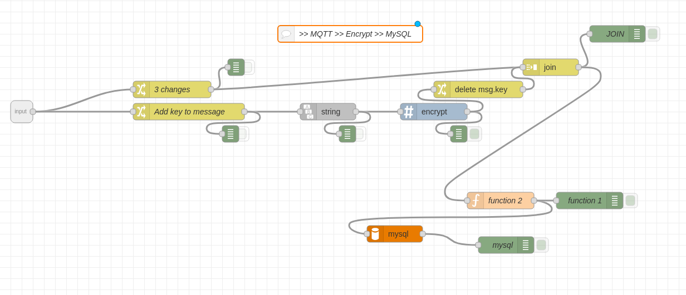

The input messages are in the JSON form. The infos that the system need from the message in input are:
- *Device*: which device is sending information; it can be retrieved from the MQTT topic;
- *Sensor*: which device sensor is reading; it can be retrieved from the JSON in input;
- *Value*: which value has the reading; it can be retrieved from the JSON in input;

Every message that flow in this subflow has to pass in the Encryption node.
The Encryption node take the *msg.key* and the *msg.payload* and makes the AES encryption.

After the encryption the message has to be purged from the key (or it will be shown in clear) and to be sent in the *function node* that build the query for the Database.
An example of query is shown belove:

``` SQl

USE sensors;
INSERT INTO Readings(device, datetime, sensor, value) VALUES('D001', NOW(), 'air', '120');`

```

The query has to be set in the *msg.topic* and has to flow in the *MySQL* node.

### Node-RED - *Query and Decrypt*

The second Node-RED sublflow analyzed is the *Query and Decrypt*.

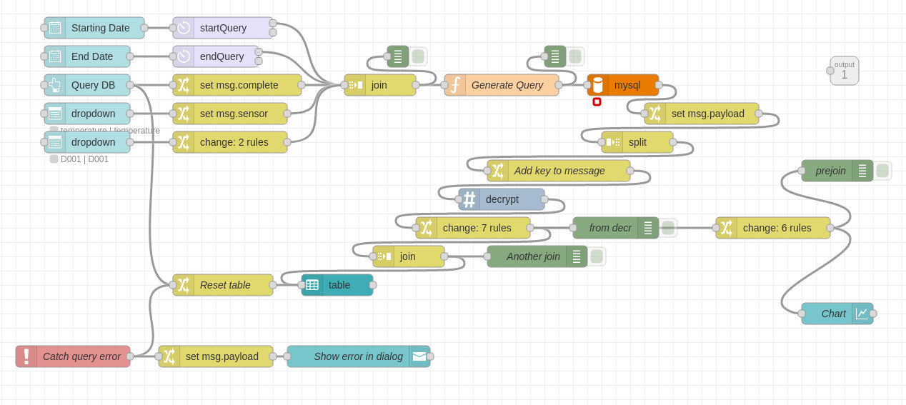

The input this time is from the user dashboard, analyzed below.

After the user input the data are converted in good format to be joined in a Query for the database.
This an example query for the database:

``` SQl

USE sensors;
SELECT * FROM Readings WHERE device='D001'
  AND sensor='temperature'
  AND datetime>='2023-06-26'
  AND datetime<'2023-06-27';

```

After the DB interrogation the output is decrypted and from them are generated two different output: a **table** with all value founded from the query and a **graph** with the curves that the sensing made in the datatime range.

## Northbound

The Northbound section of this report focuses on the applications that transparently utilize the data generated by the physical devices for visualization and interaction. This section encompasses two key components: the Android App and the Node-RED Dashboard.

### Android App

The Android App serves as a user-friendly interface, allowing users to access and interact with the IoT system. It seamlessly integrates with the data generated by the physical devices, providing real-time updates, control options, and visualizations. The Android App employs robust security measures, including secure user authentication and encrypted communication, to ensure the confidentiality and integrity of the data exchanged between the app and the IoT system.

The Android App is built using the framework **Flutter**.

Using the library *mqtt_client* written in Dart programming language, is it possible to connect every smarthphone to the Iot Project Unical project.

The app is composed by 4 module:
- ***CmdValueHandler.dart***: utils module to manage the command value sent by the android app to the system;
- ***SensorValueHandler.dart***: utils module to manage the sensing value sent by the system to the android app;
- ***main.dart***: main class that manage the app frontend;
- ***MqttHandler.dart***: that manage the MQTT through TLS connection.

#### MqttHandler.dart

The most important part of the Mqtt handler is the connection one.

``` Dart
client = MqttServerClient.withPort(
        'iotprojectunical.me', 'telefono_di_gixs1', 8883);
    client.logging(on: true);
    client.onConnected = onConnected;
    client.onDisconnected = onDisconnected;
    client.onUnsubscribed = onUnsubscribed;
    client.onSubscribed = onSubscribed;
    client.onSubscribeFail = onSubscribeFail;
    client.pongCallback = pong;
    client.keepAlivePeriod = 60;
    client.logging(on: true);
    client.secure = true;
```

Using the flag *client.secure* the flutter app knows that have to use the default *Secure Context*.

The other code written is about the handling of topic and JSon message exchanged.

#### Front End


<p align="center">
  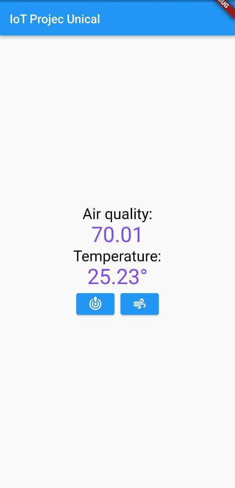
</p>

The app shows in two text field the last values of *Air quality* and *Temperature*.

The buttons are disposed to achieve the system actuation.
The one on the left close the alarm generated when the values overcome the thresholds.

The one on the right change the vent state. If the vent is on, put it off and viceversa.

That is done by sending through mqtt the command messages.

### NodeRED Dashboard

The Node-RED Dashboard complements the Android App by providing an additional platform for data visualization and interaction. It offers a customizable and intuitive interface that allows users to monitor and control the IoT system's data flow in real-time. The Node-RED Dashboard incorporates security features, such as secure access controls and encrypted communication channels, to safeguard the data as it flows between the IoT system and the dashboard.

The Northbound section highlights the significance of the Android App and the Node-RED Dashboard in enabling users to effectively visualize and interact with the data generated by the physical devices. By ensuring the security and usability of these applications, the IoT system becomes more accessible and user-friendly, empowering users to make informed decisions based on the insights derived from the data.

#### Back-end

The Dashboard back-end is composed of two part.


The one shown in the [Query and Decrypt](#node-red---query-and-decrypt), for the output from the database.
The second one is shown below and it is a realtime dashboard, showing the last value received from the sensor.

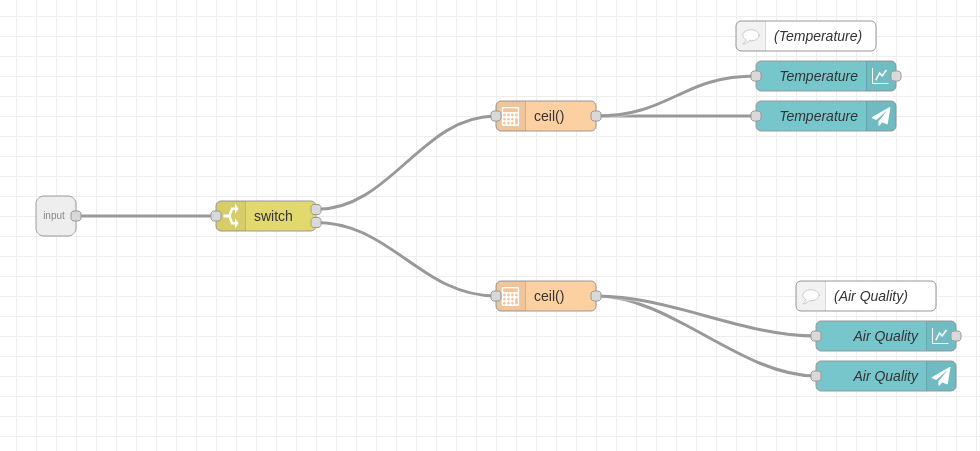

Data already formatted flow into a Non-editable Text Field and is show realtime.
Also a chart of the last hour readings is made realtime.

#### Front-end
To navigate toward the two part of the of the dashboard is build a *side navigation menu*.

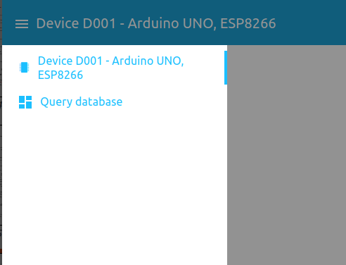

Here the user can switch from the realtime dashboard and the dashboard showing the output query from database.

The **realtime dashboard** show the last value received from the sensors and give also a graph of the last values received.

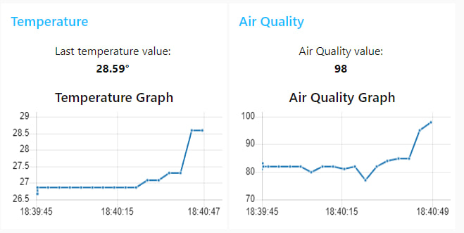

The **query database** dashboard part is divided in two part: *user input* and *output*.

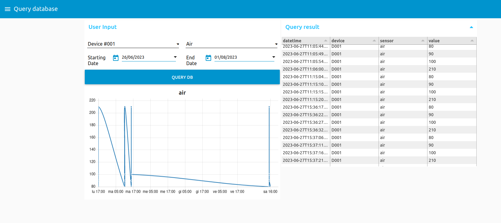

The *user input* give the possibility to insert information to query the database.

The *output* part give the output of the query as table and as graph.


## Conclusion

The IoT Security project has successfully addressed the crucial aspects of securing an IoT system, encompassing physical devices, cloud infrastructure, databases, and data visualization applications. By implementing robust security measures across these components, the project has mitigated potential vulnerabilities and ensured the confidentiality, integrity, and availability of the data.

Throughout the project, a comprehensive approach to security has been taken. Physical devices have been protected against tampering and unauthorized access, while secure protocols such as MQTT with TLS have been employed for communication between devices and the cloud. The cloud infrastructure, including the MQTT broker, database, and Node-RED, has been secured with authentication mechanisms, access controls, and encrypted connections. Moreover, the Android App and Node-RED Dashboard have provided intuitive interfaces for data visualization and user interaction while maintaining the necessary security measures.

By deliberately opting for manual data encryption in the database and employing encryption algorithms like DES, the project has demonstrated a deep understanding of encryption techniques and their application within a secure environment.

The successful implementation of this IoT Security project serves as a testament to the importance of addressing security concerns in IoT systems. The project highlights the significance of secure communication, authentication, access controls, and data encryption in safeguarding the privacy and integrity of IoT data.

As technology advances and the IoT landscape continues to expand, it becomes increasingly critical to prioritize security measures. This project has provided valuable insights and recommendations for enhancing the security posture of similar IoT deployments, serving as a foundation for future research and development in the field of IoT Security.

Overall, the project has achieved its objective of implementing robust security measures to protect the IoT system, enabling users to leverage the power of IoT technology while ensuring the confidentiality and integrity of their data.
